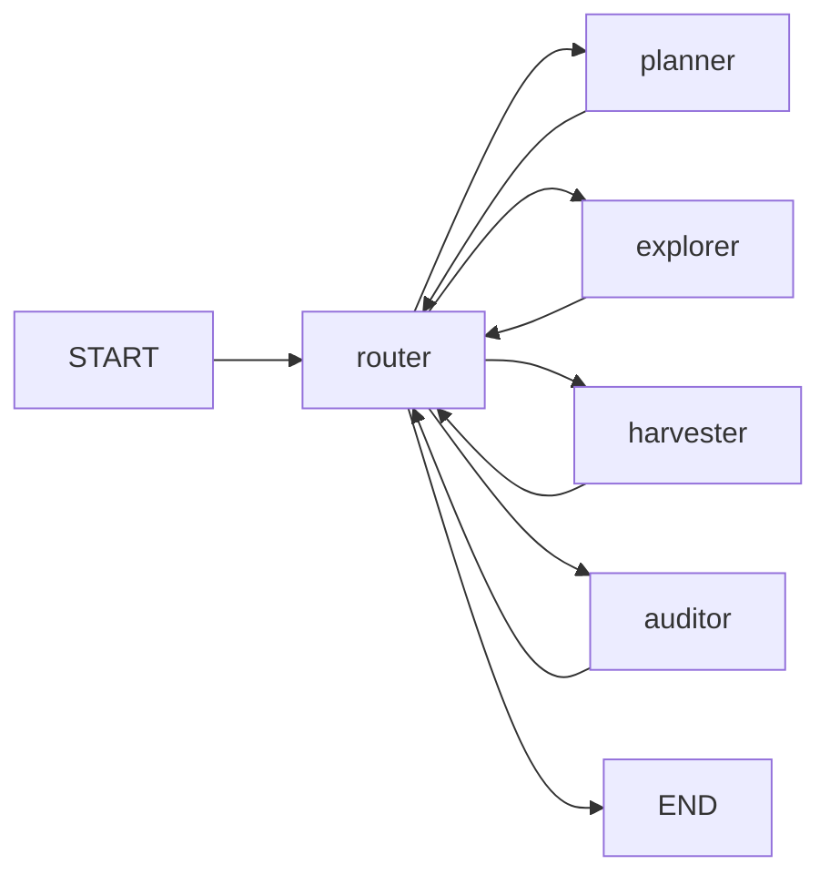

# Wild Agent

A multi-agent web text collection using LangGraph, Crawl4AI, and sentence-transformers. Define a run in YAML, provide API keys via environment variables, and collect ranked text samples from the web by theme, by similarity to example texts, or both.

## Requirements

- Python 3.11 or newer
- [uv](https://docs.astral.sh/uv/) (recommended for install and runs)
- API keys for the LLM providers referenced in your config (`api_key_env` per stage)
- Optional: `uv sync --extra providers` for xAI native web search (`langchain-xai`, `langchain-anthropic`)

## Installation

```bash
git clone <repository-url>
cd wild-agent
uv sync
cp .env.example .env
```

Set the variables named in your YAML (for example `OPENAI_API_KEY`). The CLI loads `.env` at startup via `python-dotenv`.

## Quick start

For a small first run, use an example config rather than the full default:

```bash
uv run wild-agent config/examples/theme-only.yaml
```

With no config argument, the CLI uses `config/default.yaml`:

```bash
export OPENAI_API_KEY="your-key"
uv run wild-agent
```

## How it works

Wild Agent runs a LangGraph loop: **Planner → Explorer → Harvester → Auditor**, routed by phase until `collection.target_count` is met or limits apply.



| Phase | Role |
|-------|------|
| **Planner** | Derives themes and search queries from `collection.theme` and/or `collection.examples`. |
| **Explorer** | Runs one search query per visit; enqueues URLs (capped by `max_pending_urls`). |
| **Harvester** | Crawls a batch of URLs with Crawl4AI, extracts candidate samples with an LLM, and queues them for audit. |
| **Auditor** | Accepts or rejects each sample by theme score, embedding similarity, or both. |

**Iteration limit:** `collection.max_iterations` counts explore→harvest pairs only. Auditing and draining the URL queue can continue after the limit; new searches stop when the limit is reached at the explore phase.

**Browser reuse:** One `AsyncWebCrawler` session is opened for the entire CLI run and reused across harvest steps.

## Collection modes

| Mode | Config | Acceptance |
|------|--------|------------|
| Theme | `collection.theme` | LLM relevance score ≥ `min_relevance` (0–10) and quality check |
| Examples | `collection.examples` | Cosine similarity to reference embeddings ≥ `similarity_threshold` |
| Both | `theme` and `examples` | Must pass similarity and theme checks |

`collection.examples` entries may be inline strings or paths relative to the config file directory (for example `seeds/sample.txt`).

When both theme and examples are set, the planner analyzes examples first to produce themes and queries. The configured theme is still used by the auditor as a label via `_theme_labels`.

## Configuration

Every run needs a `collection` block. Partial configs merge defaults for `harvest`, `embeddings`, and `llms` from [`config/default.yaml`](config/default.yaml); see [`src/config/loader.py`](src/config/loader.py).

### Example configs

| File | Purpose |
|------|---------|
| [`config/examples/theme-only.yaml`](config/examples/theme-only.yaml) | Theme-only, small target |
| [`config/examples/similarity.yaml`](config/examples/similarity.yaml) | Examples / similarity |
| [`config/examples/both.yaml`](config/examples/both.yaml) | Combined mode |
| [`config/examples/rap-lyrics.yaml`](config/examples/rap-lyrics.yaml) | Seed file examples and domain blocklist |

### Collection fields

| Field | Default | Description |
|-------|---------|-------------|
| `theme` | — | Theme string (required unless `examples` is set) |
| `examples` | `[]` | Reference texts or file paths |
| `target_count` | `10` | Accepted samples to collect |
| `min_relevance` | `7` | Minimum theme score (theme / both modes) |
| `similarity_threshold` | `0.7` | Minimum similarity (examples / both modes) |
| `max_iterations` | `50` | Max explore→harvest pairs |
| `max_pending_urls` | `20` | URL queue cap after each search |
| `min_words` / `max_words` | `20` / `100` | Per-sample word bounds (harvester extract + filter) |
| `output` | — | CSV path when export is desired |

### Sample length

```yaml
collection:
  min_words: 20
  max_words: 40
```

The harvester passes these bounds to the extraction LLM and filters candidates by word count. One page can yield multiple samples; the auditor drains `pending_scraped` until `target_count` is met.

### Harvest tuning

| Field | Meaning |
|-------|---------|
| `seed_batch_size` | URLs crawled per harvest graph step |
| `max_concurrent_seeds` | Parallel `arun` calls within one batch |
| `max_depth` | `0` = seed page only; `>0` enables BFS link following |
| `max_pages` | Page limit when `max_depth > 0` |
| `semaphore_count` | Concurrent fetches within one deep crawl |
| `blocked_domains` / `allowed_domains` | Host suffix filters (explorer and harvester) |
| `cache_mode` | `bypass` (default) or `enabled` for Crawl4AI disk cache |

### LLM stages

All stages use the same shape under `llms` (`planner`, `auditor`, `harvester`, `explorer`):

```yaml
explorer:
  provider: openai
  model: gpt-4o-mini
  api_key_env: OPENAI_API_KEY
  temperature: 0.2
  max_results: 10
  # base_url: ...   # optional, for Azure / xAI / proxies
```

Harvester adds `chunk_token_threshold` and `overlap_rate`. Each stage reads its API key from the environment variable named by `api_key_env`.

### Explorer search behavior

| `provider` | Search method |
|------------|----------------|
| `openai`, `xai` | LangChain Responses API with hosted `web_search` tool |
| Others (e.g. `anthropic`, `groq`) | DuckDuckGo fallback (no extra API key; a warning is logged at load time) |

For xAI native web search: `uv sync --extra providers`, set `provider: xai`, and optionally `base_url: https://api.x.ai/v1`.

### Embeddings

```yaml
embeddings:
  model: all-MiniLM-L6-v2
```

Used when `collection.examples` is set to embed references and score candidates.

## Output

When `collection.output` is set and at least one sample is accepted, the CLI writes a CSV with these columns:

| Column | Description |
|--------|-------------|
| `content` | Sample text (truncated to 1000 characters in export) |
| `url` | Source page URL |
| `title` | Page title if available |
| `similarity_score` | Embedding similarity (examples / both modes) |
| `relevance_score` | LLM theme score (theme / both modes) |
| `matched_reference_index` | Index of closest reference example |
| `themes` | Pipe-separated theme labels |
| `scraped_at` | Collection timestamp |

`*.csv` files are listed in `.gitignore` and are not committed.

Final samples are sorted by similarity score (examples / both) or relevance score (theme-only) before export.

## Project structure

```
src/
  main.py           # CLI entry
  agents/           # LangGraph nodes, graph, crawler session
  config/           # Pydantic models, YAML loader, LLM factory
  search/           # URL extraction, domain filter
  similarity/       # Embedding scoring
  text/             # Word-count helpers
config/
  default.yaml      # Full schema and defaults
  examples/         # Partial example configs
tests/
```

## Development

```bash
uv sync --extra dev
uv run pytest
uv run ruff check .
```

## License

MIT
